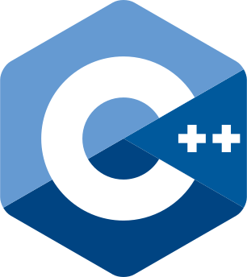
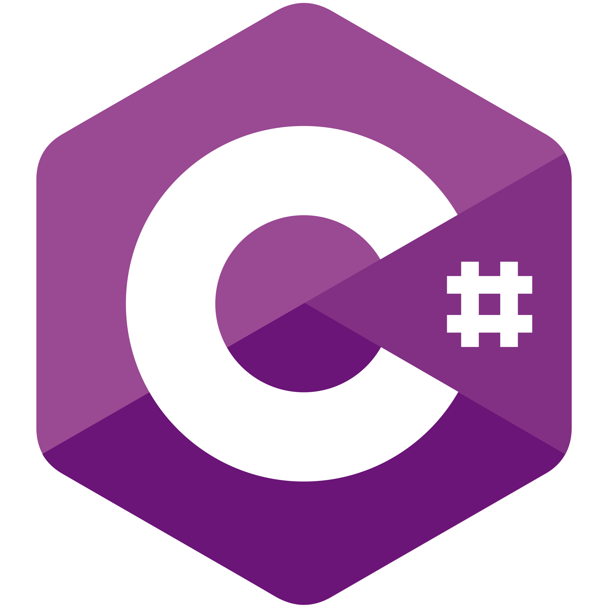
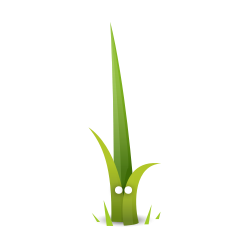
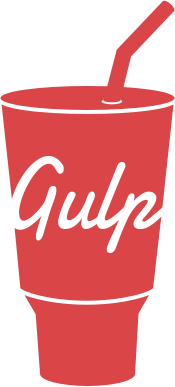
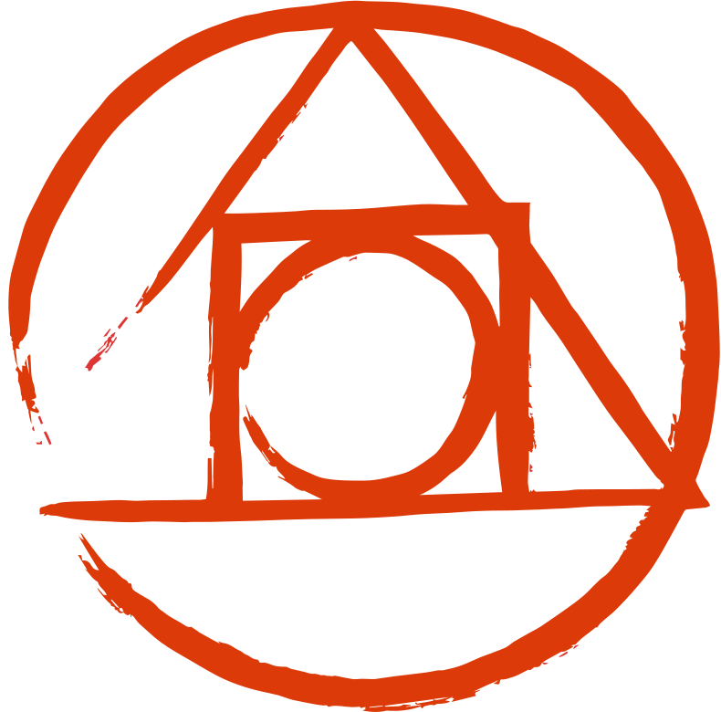
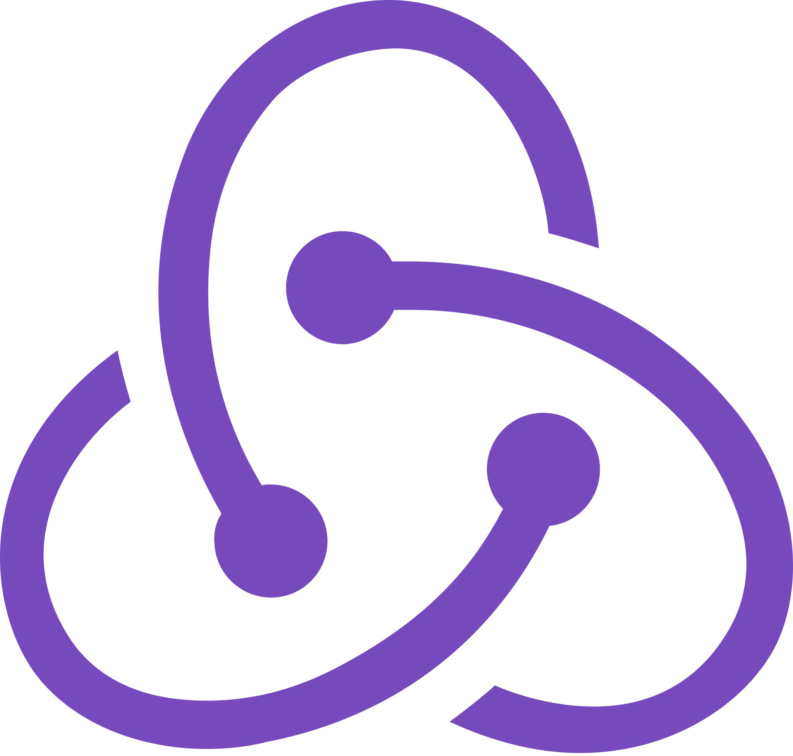
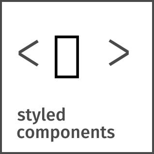
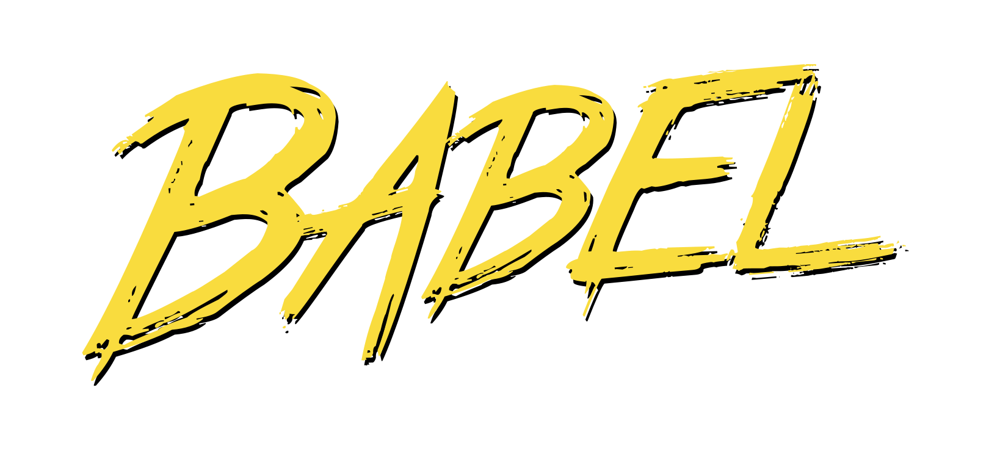

<h2 align="center" style="font-family: Montserrat; font-weight: 900; font-size: 24px"> Welcome to my profile </h2>

<h2 style="font-family: Montserrat;"> 🌺 Hi, i'm Kahevich, a self-taught full stack web developer. my passion for software lies with dreaming up ideas and making them come true with elegant interfaces. i take great care in the experience, architecture, and code quality.
 
 
🧠 I learned a lot from the open-source community and i love how collaboration and knowledge sharing happened through open-source.</h2>
 

 

# 
🔥 Languages & Frameworks & Tools & Abilities 🔥

<table align="center" style="font-family: Montserrat; font-weight: 500; font-size: 15px">
  <tr>
    <td align="center" width="96">
      
        
      
HTML

    </td>
    <td align="center" width="96">
      
       
      
CSS

    </td>
    <td align="center" width="96">
      
       
      
JavaScript

    </td>
    <td align="center"  width="96">
      
       
      
PHP

    </td>
    <td align="center" width="96">
      
       
      
Python

    </td>
    <td align="center" width="96">
      
       
      
С++

    </td>
    <td align="center" width="96">
      
       
      
С#

    </td>
    <td align="center"  width="96">
      
       
      
Linux

    </td>
  </tr>
  <tr>
    <td align="center" width="96">
      
       
      
Pug

    </td>
    <td align="center" width="96">
      
       
      
Bootstrap

    </td>
    <td align="center" width="96">
      
       
      
MaterializeCSS

    </td>
    <td align="center" width="96">
      
       
      
Handlebars

    </td>
    <td align="center"  width="96">
      
        
      
Twig

    </td>
    <td align="center" width="96">
      
       
      
Sass
 
    </td>
    <td align="center"  width="96">
      
       
      
LESS

    </td>
    <td align="center" width="96">
      
       
      
VScode

    </td>
  </tr>
  <tr>
    <td align="center" width="96">
      
       
      
Jquery

    </td>
    <td align="center"  width="96">
      
       
      
Three.js

    </td>
    <td align="center" width="96">
      
       
      
GSAP

    </td>
    <td align="center" width="96">
      
       
      
Webpack

    </td>
    <td align="center" width="96">
      
       
      
TypeScript

    </td>
    <td align="center" width="96">
      
       
      
Gulp

    </td>
    <td align="center" width="96">
      
        
      
NodeJS

    </td>
    <td align="center" width="96">
      
       
      
React

    </td>
  </tr>
  <tr>
    <td align="center" width="96">
      
       
      
CoffeeScript

    </td>
    <td align="center" width="96">
      
       
      
PostCSS

    </td>
    <td align="center" width="96"> 
      
       
      
Redux

    </td>
    <td align="center" width="96">
      
       
      
Next.js

    </td>
    <td align="center" width="96">
      
       
      
Mo.js

    </td>
    <td align="center"  width="96">
      
       
      
MySQL

    </td>
    <td align="center" width="96">
      
       
      
Laravel

    </td>
    <td align="center" width="96">
      
       
      
Stylus

    </td>
  </tr>
  <tr>
    <td align="center"  width="96">
      
       
      
Wordpress

    </td>
    <td align="center" width="96"> 
      
       
      
Git

    </td>
    <td align="center" width="96">
      
       
      
Figma

    </td>
    <td align="center" width="96">
      
       
      
Docker

    </td>
    <td align="center"  width="96">
      
       
      
Kali

    </td>
    <td align="center"  width="96">
      
       
      
Unity

    </td>
    <td align="center"  width="96">
      
       
      
NPM

    </td>
    <td align="center"  width="96">
      
       
      
Nunjucks

    </td>
  </tr>
  <tr>
    <td align="center"  width="96">
      
       
      
Composer

    </td>
    <td align="center"  width="96">
      
       
      
GraphQL

    </td>
    <td align="center"  width="96">
      
       
      
Jest

    </td>
    <td align="center"  width="96">
      
       
      
Styled

    </td>
    <td align="center"  width="96">
      
       
      
Tailwind

    </td>
    <td align="center"  width="96">
      
       
      
Zeplin

    </td>
    <td align="center"  width="96">
      
       
      
Babel

    </td>
    <td align="center"  width="96">
      
       
      
Airbnb

    </td>
  </tr>
</table>
 

<!--
# 

 <h2 align="center" style="font-family: Montserrat; font-weight: 500; font-size: 24px">⌛ Additional tools for work ⏳</h2>

|  |
| ----------- |
|  |
|  |
|  |
 -->

# <h2 align="center" style="font-family: Montserrat; font-weight: 500; font-size: 24px">⚡ Stats ⚡</h2>

 

  

    
  

  

    
  

   
  

 
  

<!-- 1 2 3 4 5 6 7 8 9 10 11 12 13 14 15 16 17 18 19 20 21 22 23 24 25 26 27 28 29 30 31 32 33 34 35 36 37 38 39 40 41 42 43 44 45 46 47 48 49 50 51 git commit --amend --date="Wed Aug 3 14:00 2021 +0100" --no-edit  git commit --date="10 day ago" -m "Your commit message" rm -f .git/index.lock
 -->
